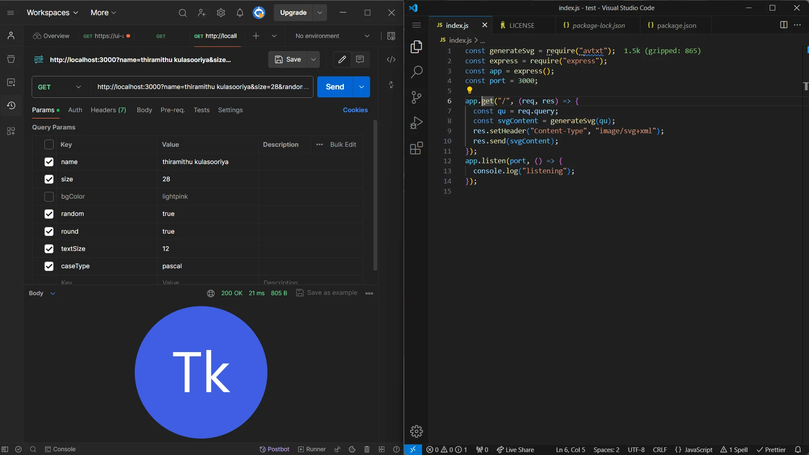

# AvTXT

avtxt is a simple Node.js library for generating avatars with initials from names using SVG. It allows you to create customizable avatars for user profiles, chat applications, and more.

## Installation

You can install avtxt via npm:

```bash
npm install avtxt
```

## Usage 

avtxt npm package supports both commonjs & esm approach.

### Example 1

```javascript
import generateSvg from 'avtxt'
//const generateSvg = require('avtxt'); 

const svgContent = generateSvg({
  name: 'Thiramithu Kulasooriya',
  round: true,
  size: 100,
  fontSize: 40,
  bgColor: '#007bff',
  textColor: '#ffffff',
  caseType: 'simple', 
  random: false
});

console.log(svgContent);
```

### Example 2

```javascript
import generateSvg from 'avtxt'
import express from "express"

//const generateSvg = require('avtxt');
//const express = require("express");

const app = express();
const port = 3000;

app.get("/", (req, res) => {
    const qu = req.query;
    const svgContent = generateSvg(qu);
    res.setHeader("Content-Type", "image/svg+xml");
    res.send(svgContent);
});
  app.listen(port, () => {
    console.log("listening");
  });
  
```



### Example 3

```jsx
import React, { useState, useEffect } from "react";
import generateSvg from "avtxt";

function App() {
  const [svgContent, setSvgContent] = useState(null);

  useEffect(() => {
    setSvgContent(generateSvg({ name: "Thiramithu Kulasooriya", round: true, size: 100, textSize: 40, random: "true", caseType: "pascal" }));
  }, []);

  const svgDataUri = svgContent ? `data:image/svg+xml;base64,${btoa(svgContent)}` : null;

  return (
    <>
      {svgContent && (
        
      )}
    </>
  );
}

export default App;

```

## Parameters

- name (string, required): The name used to generate the initials.
- round (boolean, optional): Determines whether the avatar should be round or rectangular. Default is false.
- size (number, optional): The size of the avatar in pixels. Default is 64.
- fontSize (number, optional): The font size of the initials in pixels. Default is 28.
- bgColor (string, optional): The background color of the avatar in hexadecimal format. Default is #ddd.
- textColor (string, optional): The color of the initials in hexadecimal format. Default is #222.
- caseType (string, optional): The casing type for initials. Options are 'simple', or 'pascal'. Default is upperCase.
- random (boolean, optional): Determines whether to use randomly generated contrasting colors for the avatar. Default is false.

## License

This project is licensed under the MIT License. See the LICENSE file for details

## Contribution

Contributions are welcome! Here are some guidelines:

1. Fork the repository.
2. Create a new branch for your feature: git checkout -b feature-name.
3. Make your changes and commit them: git commit -am 'Add new feature'.
4. Push to the branch: git push origin feature-name.
5. Submit a pull request.
Please make sure your code follows the existing code style and includes tests if applicable.
 
## Contact 

If you have any questions or suggestions, feel free to contact Me.
